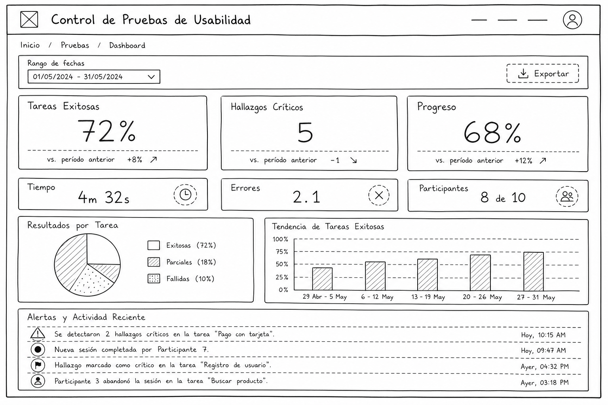

# Dashboard Mejorado - Wireframe Lo-Fi

**Proyecto:** Usability Test Dashboard 2.0  
**Fase:** 3 - Rediseño UX  
**Fidelidad:** Baja (estructura, flujos, jerarquía básica)  
**Pantalla Base:** Dashboard Principal  

---



---

## 🎯 Objetivos de Rediseño

Resolver problemas D1, D2, D3, D4, D5, D6, D7, D8, D9, D10 mediante:
- ✅ Leyes de Gestalt: Proximidad (agrupar métricas), continuidad (flujo visual)
- ✅ Jerarquía Visual: Tamaño, color, posición, peso
- ✅ Arquitectura Info: Zonificación clara, agrupación lógica
- ✅ Navegación Contextual: Botones de acción en cards, drill-down
- ✅ Prevención Errores: Indicadores de estado, validación visual
- ✅ Diseño Emocional: Color significativo, tonos confiables, animaciones suaves

---

## 📐 Layout General (Lo-Fi)

```
╔════════════════════════════════════════════════════════════════════════════════╗
║                           DASHBOARD - USABILITY TEST                           ║
╠════════════════════════════════════════════════════════════════════════════════╣
║  HEADER SECTION                                                                ║
│  ┌─────────────────────────────────────────────────────────────────────────┐  ║
│  │ Título: "Control de Pruebas de Usabilidad"      [🔄 Última actualización] │  ║
│  │ Breadcrumb: Dashboard > Resumen                                          │  ║
│  └─────────────────────────────────────────────────────────────────────────┘  ║
├────────────────────────────────────────────────────────────────────────────────┤
║  CONTROLS BAR (Filtros y Acciones)                                            ║
│  ┌─────────────────────────────────────────────────────────────────────────┐  ║
│  │ [🗓️ Rango de Fechas: Última semana ▼] [📊 Exportar PDF] [⚙️ Opciones]  │  ║
│  └─────────────────────────────────────────────────────────────────────────┘  ║
├────────────────────────────────────────────────────────────────────────────────┤
║  PRIMARY KPI SECTION (Zona Crítica - Arriba, Grande)                          ║
│  ┌──────────────────────┐  ┌──────────────────────┐  ┌──────────────────────┐ ║
│  │  TAREA EXITOSA       │  │ HALLAZGOS CRÍTICOS   │  │  PROGRESO GENERAL    │ ║
│  │  72%                 │  │  5 ABIERTOS          │  │  68% ⬆️ Completadas   │ ║
│  │  ↑ +5% esta semana   │  │  🔴 REQUIERE ACCIÓN  │  │  [===========░░░░░]  │ ║
│  │  [Ver Detalle]       │  │  [Ir a Reportes]     │  │  [Ver Roadmap]       │ ║
│  └──────────────────────┘  └──────────────────────┘  └──────────────────────┘ ║
├────────────────────────────────────────────────────────────────────────────────┤
║  SECONDARY METRICS (Zona Secundaria - Mediano)                                 ║
│  ┌──────────────────────┐  ┌──────────────────────┐  ┌──────────────────────┐ ║
│  │ Tiempo Promedio      │  │ Errores por Tarea    │  │ Participantes Activos │ ║
│  │ 4m 32s               │  │ 2.1 errores/tarea    │  │ 8 de 10              │ ║
│  │ [Analizar]           │  │ [Tendencia ↓ Bueno]  │  │ [Ver Lista]          │ ║
│  └──────────────────────┘  └──────────────────────┘  └──────────────────────┘ ║
├────────────────────────────────────────────────────────────────────────────────┤
║  CHARTS SECTION - Dos Columnas                                                ║
│  ┌─────────────────────────────────────┐┌─────────────────────────────────────┐║
│  │ GRÁFICO 1: TASA ÉXITO POR TAREA     ││ GRÁFICO 2: HALLAZGOS POR SEVERIDAD ││
│  │                                     ││                                     ││
│  │  [Radial/Pie con etiquetas]         ││  [Bar chart con leyenda]            ││
│  │  - Tarea A: 85%                     ││  - Crítica: 5 (RO JO)               ││
│  │  - Tarea B: 72%                     ││  - Alta: 12 (NARANJA)               ││
│  │  - Tarea C: 61%                     ││  - Media: 8 (AMARILLO)              ││
│  │  - Tarea D: 91%                     ││  - Baja: 3 (VERDE)                  ││
│  │                                     ││                                     ││
│  │  [Ver todas las tareas]             ││  [Filtrar por estado]               ││
│  └─────────────────────────────────────┘└─────────────────────────────────────┘║
├────────────────────────────────────────────────────────────────────────────────┤
║  RECENT ACTIVITY / ALERTS SECTION (Inferior)                                   ║
│  ┌─────────────────────────────────────────────────────────────────────────┐  ║
│  │ 🔔 ALERTAS Y ACTIVIDAD RECIENTE (Últimas 24 horas)                      │  ║
│  │ ┌─────────────────────────────────────────────────────────────────────┐ │  ║
│  │ │ 🔴 [CRÍTICO] Nueva hallazgo: Botón Login no visible - Tarea 3        │ │  ║
│  │ │ 🟠 [MODERADO] 2 participantes sin completar sesión - Actualizar    │ │  ║
│  │ │ 🟡 [INFO] Nueva prueba "Checkout Flow" iniciada - En progreso      │ │  ║
│  │ │ ✅ [COMPLETADO] Prueba "Sign-up" finalizada con 95% éxito          │ │  ║
│  │ │                                         [Ver Todo] [Limpiar]        │ │  ║
│  │ └─────────────────────────────────────────────────────────────────────┘ │  ║
│  └─────────────────────────────────────────────────────────────────────────┘  ║
╚════════════════════════════════════════════════════════════════════════════════╝
```

---

## 🧠 Principios de Gestalt Aplicados

### 1. **Proximidad** (Agrupación)
```
ANTES (Confuso):
[KPI1] [KPI2] [KPI3]
[KPI4] [KPI5] [KPI6]

DESPUÉS (Claro):
[KPI Críticos]        [KPI Secundarios]
├─ Éxito              ├─ Tiempo
├─ Hallazgos Críticos ├─ Errores
├─ Progreso           └─ Participantes
```

### 2. **Similitud** (Visual Consistency)
- Todas las KPI cards de primaria: **tamaño 240x140px, borde 2px, shadow grande**
- Todas las KPI cards de secundaria: **tamaño 200x120px, borde 1px, shadow suave**
- Color rojo para críticos, verde para positivos, gris para neutros

### 3. **Continuidad** (Flujo Visual)
- Lectura de arriba hacia abajo: Crítico → Secundario → Análisis → Actividad
- Cada zona tiene separador visual (línea, espacio, color de fondo)

### 4. **Cerramiento** (Boundary)
- Cards con bordes claros encierran información relacionada
- Secciones tienen background ligeramente diferente

---

## 📊 Zona 1: KPIs Primarios (CRÍTICOS)

**Ubicación:** Top center, máximo 40% del viewport  
**Componentes:** 3 cards grandes + indicadores de estado  
**Principios:** Jerarquía visual máxima

```
┌────────────────────────────────────────────────────────────────────────────┐
│  KPI PRIMARIOS - MÉTRICA MÁS IMPORTANTE (Zona Visual Premium)             │
├────────────────────────────────────────────────────────────────────────────┤
│                                                                            │
│  ┏━━━━━━━━━━━━━━━━━━━━━━━┓  ┏━━━━━━━━━━━━━━━━━━━━━━━┓ ┏━━━━━━━━━━━━━━━━┓
│  ┃ ✅ TAREAS EXITOSAS   ┃  ┃ 🔴 HALLAZGOS CRÍTICOS ┃ ┃ 📊 PROGRESO   ┃
│  ┃                      ┃  ┃                        ┃ ┃                ┃
│  ┃       72%            ┃  ┃        5 ABIERTOS      ┃ ┃    68%         ┃
│  ┃   ↑ +5% esta semana  ┃  ┃  🟢 Necesita acción    ┃ ┃  Completadas   ┃
│  ┃  [Ver Detalle →]     ┃  ┃  [Ir a Reportes →]     ┃ ┃  [Roadmap →]   ┃
│  ┗━━━━━━━━━━━━━━━━━━━━━━━┛  ┗━━━━━━━━━━━━━━━━━━━━━━━┛ ┗━━━━━━━━━━━━━━━━┛
│
│  FONDO: Blanco o muy claro
│  SOMBRA: Grande (4px offset, 12px blur, 20% alpha)
│  BORDE: Redondeado 12px, 2px stroke en color del tema
│  TAMAÑO: Cada card 240x160px
│
└────────────────────────────────────────────────────────────────────────────┘

JERARQUÍA VISUAL:
- Número grande: 56px, peso 700, color primario (azul para Éxito, rojo para Críticos)
- Contexto: 14px, peso 500, gris oscuro
- Cambio: 12px, peso 500, verde (↑ positivo), rojo (↓ negativo)
- Botón: 12px, peso 600, subrayado, cursor pointer
```

---

## 📈 Zona 2: KPIs Secundarios

**Ubicación:** Centro, bajo primarios  
**Componentes:** 3 cards medianos sin acciones  
**Principios:** Lectura rápida

```
┌────────────────────────────────────────────────────────────────────────────┐
│  KPIs SECUNDARIOS - INFORMACIÓN COMPLEMENTARIA                             │
├────────────────────────────────────────────────────────────────────────────┤
│                                                                            │
│  ┌──────────────────────┐  ┌──────────────────────┐  ┌──────────────────┐
│  │⏱️ Tiempo Promedio    │  │❌ Errores por Tarea  │  │👥 Participantes   │
│  │                      │  │                      │  │                   │
│  │      4m 32s          │  │  2.1 errores/tarea   │  │   8 de 10        │
│  │   Rango: 2m - 8m     │  │  Tendencia: ↓ Bueno  │  │   80% Activos    │
│  │   [Detalle]          │  │                      │  │   [Listar]       │
│  └──────────────────────┘  └──────────────────────┘  └──────────────────┘
│
│  TAMAÑO: Cada card 200x140px
│  SOMBRA: Suave (2px offset, 8px blur, 10% alpha)
│  BORDE: 1px gris claro
│
└────────────────────────────────────────────────────────────────────────────┘
```

---

## 📊 Zona 3: Gráficos Analíticos (50% del espacio)

**Componentes:** 2 gráficos principales  
**Principios:** Contexto, leyendas claras, tooltips

```
┌────────────────────────────────────────────────────────────────────────────┐
│  ANÁLISIS - GRÁFICOS CON CONTEXTO                                          │
├────────────────────────────────────────────────────────────────────────────┤
│                                                                            │
│  Izquierda 50%:                  Derecha 50%:                             │
│  ┌────────────────────────┐     ┌─────────────────────────┐              │
│  │ Tasa Éxito por Tarea   │     │ Hallazgos por Severidad │              │
│  │                        │     │                         │              │
│  │    [Radial Chart]      │     │  [Bar Chart Horizontal] │              │
│  │    - Tarea A: 85% 🟩   │     │  Crítica:  ████ 5      │              │
│  │    - Tarea B: 72% 🟨   │     │  Alta:     ████████ 12 │              │
│  │    - Tarea C: 61% 🟥   │     │  Media:    ██████ 8    │              │
│  │    - Tarea D: 91% 🟩   │     │  Baja:     ███ 3       │              │
│  │                        │     │                         │              │
│  │ [Ver Detalles] [Zoom]  │     │ [Filtrar] [Exportar]    │              │
│  └────────────────────────┘     └─────────────────────────┘              │
│                                                                            │
│  Ambos gráficos:                                                           │
│  - Tooltips al hover con valores exactos                                   │
│  - Leyendas visibles permanentemente                                       │
│  - Axis labels en gráficos (qué se mide en Y, qué en X)                  │
│  - Responsive: En móvil se apilan verticalmente                           │
│                                                                            │
└────────────────────────────────────────────────────────────────────────────┘
```

---

## 🔔 Zona 4: Alertas y Actividad Reciente

**Ubicación:** Bottom, zona de contexto  
**Componentes:** Timeline de eventos  
**Principios:** Urgencia visual (colores), información contextual

```
┌────────────────────────────────────────────────────────────────────────────┐
│  ACTIVIDAD RECIENTE & ALERTAS - Útiles pero no distractoras               │
├────────────────────────────────────────────────────────────────────────────┤
│                                                                            │
│  ┌─────────────────────────────────────────────────────────────────────┐ │
│  │ 📍 ALERTAS Y CAMBIOS RECIENTES (últimas 24 horas)                   │ │
│  │                                                                     │ │
│  │  🔴 [16:45] CRÍTICO - Hallazgo nuevo: Botón no encontrado          │ │
│  │     Tarea "Login", detectado por 4 usuarios [VER DETALLES]         │ │
│  │                                                                     │ │
│  │  🟠 [15:20] MODERADO - Sesión incompleta: 2 participantes offline  │ │
│  │     Juan López, María García [CONTACTAR]                           │ │
│  │                                                                     │ │
│  │  🟡 [14:10] INFO - Prueba iniciada: "Checkout Flow"                │ │
│  │     En progreso, 3 de 5 participantes activos                      │ │
│  │                                                                     │ │
│  │  ✅ [13:45] COMPLETADO - "Sign-up" terminada: 95% éxito            │ │
│  │     7 hallazgos encontrados, reportar [REVISAR]                    │ │
│  │                                                                     │ │
│  │  [← Anteriores]                             [Limpiar alertas] [+]  │ │
│  └─────────────────────────────────────────────────────────────────────┘ │
│                                                                            │
│  COMPONENTES:                                                              │
│  - 4 items principales (con scroll para ver más)                          │
│  - Cada item: Color de icono + timestamp + descripción + acción           │
│  - Background muy suave (gris 1% opacidad)                                │
│  - Sin distracción de contenido principal                                 │
│                                                                            │
└────────────────────────────────────────────────────────────────────────────┘
```

---

## 🎨 Jerarquía Visual (Tamaños Relativos)

```
ESCALA DE IMPORTANCIA:

Nivel 1 (MÁXIMO - Zona Premium, Arriba):
├─ KPI Primario número: 56px, color primario, peso 700
├─ Título zona: 24px, peso 600
└─ Sombra grande: 12px blur

Nivel 2 (ALTO - Info contextual):
├─ KPI Secundario número: 32px, peso 600
├─ Contexto (cambio %): 14px, peso 500
├─ Subtítulos gráficos: 16px, peso 500
└─ Sombra mediana: 8px blur

Nivel 3 (BAJO - Detalles):
├─ Labels de datos: 12px, peso 400
├─ Valores de eje: 11px, peso 400
├─ Timestamps: 12px, peso 400
└─ Sin sombra o mínima

Nivel 4 (MÍNIMO - Metadata):
├─ Hints de ayuda: 10px, peso 400, gris claro
└─ Sin énfasis visual
```

---

## 🚀 Interacciones Previstas

### En Cards (Botones/Links)
- Click en card gris → Sin efecto, solo hover
- Click en [Botón Acción] → Navega o abre modal
- Hover en card → Elevación (shadow aumenta 2x)

### En Gráficos
- Hover en serie → Resalta esa serie, tooltip aparece
- Click en etiqueta → Drill-down o filtro aplicado

### En Alertas
- Hover en alerta → Background destaca
- Click en [VER DETALLES] → Abre modal o navega a vista detallada

---

## ✅ Aplicación de Principios UX

| Principio | Aplicación |
|-----------|-----------|
| **Gestalt - Proximidad** | KPIs agrupados por importancia en zonas |
| **Gestalt - Similitud** | Mismo tamaño para cards del mismo nivel |
| **Gestalt - Continuidad** | Flujo visual de arriba a abajo: crítico → análisis → historia |
| **Jerarquía Visual** | Tamaños, pesos y colores escalonados |
| **Arquitectura Info** | Zonificación clara: Resumen → Análisis → Contexto |
| **Navegación Contextual** | Botones [Ver], [Detalles], [Ir a] en cada card |
| **Prevención Errores** | Indicadores de estado (✅ ↑ 🔴) visuales |
| **Diseño Emocional** | Colores significativos (rojo=urgencia, verde=bien), iconos comunicativos |
| **Feedback** | Transiciones suaves, hover states, tooltips |
| **Responsive** | Layout se adapta pero mantiene jerarquía |

---

## 📱 Consideraciones Móvil

```
En pantallas < 768px:
- KPIs se apilan 1 por fila (100% ancho)
- Gráficos se apilan verticalmente
- Fonte se reduce proporcionalmente
- Breadcrumb se simplifica
- Alertas se reducen a íconos con contador
```

---

**SIGUIENTE PASO:** Crear wireframe Mid-Fi con componentes específicos, espaciados exactos y definición de colores base.